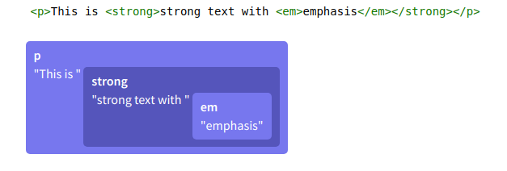
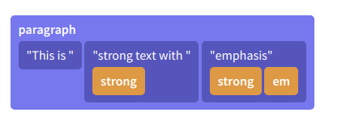

# ProseMirror

## 参考：
+ [ProseMirror官方文档](https://prosemirror.net/docs/)
+ [ProseMirror - 模块化的富文本编辑框架](https://juejin.im/post/5b5061d051882519a62f6164)
+ [WYSISYN编辑器 Prosemirror 入门](https://juejin.im/post/5a93f736f265da4e840956d4)

---


## ProseMirror简介
prosemirror是一个基于contentEditable用于在Web上构建富文本编辑器的工具包，由无数个小的模块组成，主要核心模块有：
+ **prosemirror-model** 定义编辑器的文档模型，用于描述编辑器内容的数据结构。
+ **prosemirror-state** 提供描述编辑器整个状态的数据结构，包括选择(`selection`)，以及用于从一个状态移动到下一个状态的事务(`transaction`)系统。
+ **prosemirror-view** 实现一个用户界面组件，该组件将给定的编辑器状态显示为浏览器中的可编辑元素，并处理用户与该元素的交互。
+ **prosemirror-transform** 包含以可记录和重放的方式修改文档的功能，这是state模块中事务的基础，并使撤消历史记录和协作编辑成为可能。

除此之外还有一些常用的模块：
+ **prosemirror-commands** 基本编辑命令
+ **prosemirror-keymap** 键绑定
+ **prosemirror-history** 历史记录
+ **prosemirror-collab** 协作编辑
+ **prosemirror-schema-basic** 简单文档模式
+ **prosemirror-markdown** 实现markdown文本与此模式的文本进行转换。
+ **prosemirror-example-setup** 提供了一个

## 实现一个简单的编辑器

```
import { schema } from "prosemirror-schema-basic"
import { EditorState } from "prosemirror-state"
import { EditorView } from "prosemirror-view"

let state = EditorState.create({ schema })
let view = new EditorView(document.body, { state })

```
每个ProseMirror文档都有一个与之关联的schema（模式），schema描述了文档中可能出现的节点类型，以及它们嵌套的方式。


Prosemirror定义了自己的数据结构来表示文档内容。在prosemirror结构与HTML的Dom结构之间，需要一次解析与转化，这两者间相互转化的桥梁，就是我们的schema，这里我们先了解一下prosemirror的文档结构。

prosemirror的文档是一个Node,它包含零个或多个child Nodes的Fragment(片段)。
有点类似浏览器DOM的递归和树形的结构。但它在存储内联内容方式上有所不一样。

HTML的文档结构，是这样的树结构：



prosemirror，内联内容被建模为平面序列，标记作为节点的附加数据:



回到schema，其实就是两种文档间转化的模式，以markdown为例：

[prosemirror-markdown-schema.js](https://github.com/ProseMirror/prosemirror-markdown/blob/master/src/schema.js)

通过这样的文本规则，解析器或者序列器才能知道如何去解析。任何一个在编辑器中出现的Dom以及任何一个需要转化成Dom的节点类型，都需要有一个对应的schema，否则无法编译。

我们把源码部分简化一下，其实就是这样的一个结构：

`export const schema = new Schema({nodes, marks})`

schema是Schema通过传入的nodes, marks生成的实例。同样简化一下，node的结构如下：

```
{
  doc: {...} // 顶级文档
  paragraph: {...} //<p>
  blockquote: {...} //<blockquote>
  horizontal_rule： {...} //<hr>
  heading: {...} //<h1>..<h6>
  code_block: {...} //<pre>
  ordered_list: {...} //<ol>
  bullet_list:: {...} //<ul>
  list_item: {...} //<li>
  text: {...} //文本
  image: {...} //
  hard_break: {...} //<br>
}
```
mark:
```
{
  em: {...} //<em>
  link: {...} //<a>
  strong: {...} //<strong>
  code: {...} //<code>
}
```

回到例子：
```
import { schema } from "prosemirror-schema-basic"
import { EditorState } from "prosemirror-state"
import { EditorView } from "prosemirror-view"

let state = EditorState.create({ schema })
let view = new EditorView(document.body, { state })

```
我们使用EditorState.create通过基础规则schema创建了编辑器的状态state。接着，为状态state创建了编辑器的视图，并附加到了document.body。这会将我们的状态state呈现为可编辑的dom节点，并在用户键入时产生transaction。

当用户键入或者其他方式与视图交互时，都会产生transaction。描述对state所做的更改，并且可以用来创建新的state，然后更新视图。

```
let view = new EditorView(document.body, {
  state,
  dispatchTransaction(transaction) {
    console.log("create new transaction")
    let newState = view.state.apply(transaction)
    view.updateState(newState)
  }
})
```
在这里，dispatchTransaction函数就是每次更改state时产生一个transaction时调用的函数，每次都会在控制台打印一句话。
这样写的话，每个state更新都必须手动调用updateState。
