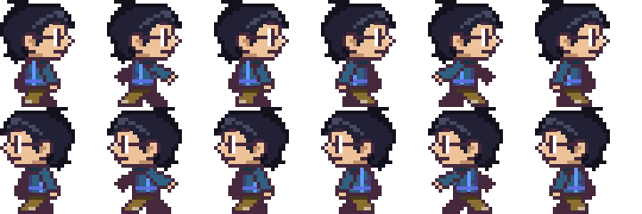
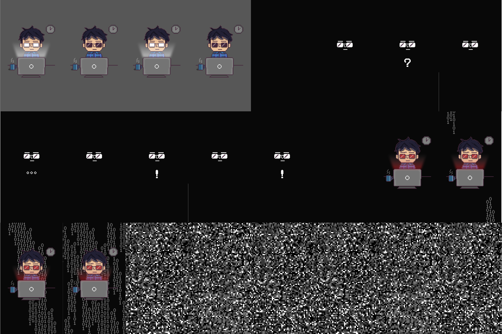

# phaser分享

参考：
+ [从零到一：用Phaser.js写意地开发小游戏](https://segmentfault.com/a/1190000009212221)
+ [phaser.js入门篇](https://blog.csdn.net/u014451076/article/details/51499564)
+ [Phaser.Game这个函数都有哪些参数](https://www.cnblogs.com/cbryge/p/6114873.html)

Phaser**将一切渲染在canvas元素上**，所以body标签里可能只包含一个canvas元素。

基于canvas能使游戏性能更好。尤其是牵涉到动画上。

以下内容都基于phaser2


## 定义game

```
var game = new Phaser.Game(800, 600, Phaser.AUTO, '', { preload: preload, create: create, update: update });  
```

官方文档：
`new Game(width, height, renderer, parent, state, transparent, antialias, physicsConfig)`

游戏长宽、渲染方式、用来放置游戏canvas的父元素、游戏场景(在这里指定state表示让游戏首先加载这个场景)、画布元素是否透明、是否启用抗锯齿，物理引擎配置

每个参数都是可选的。默认是800×600 Phaser.AUTO '' null 

<!-- game几个重要的属性：
    game.paused = false; //游戏暂停或继续 

    game.input //游戏中的用户交互事件

    game.load //加载游戏资源
    game.scale 游戏缩放模块的引用
    game.sound
    game.stage
    game.world
    game.particles 游戏粒子系统的引用
    game.physics
    game.state 游戏场景管理对象的引用 -->

## 定义state（游戏场景）

state可以是一个js自定义对象，也可以是一个函数，只要它们存在preload、create、update这三个方法中的任意一个，就是一个合法的state。

```
// 定义state为一个对象
var state1 = {
    preload : function () { },
    create : function () { },
    update : function () { }
}

// 定义state为一个构造函数
function state( ) {
    this.init = function () {};
    this.preload = function () {};
    this.create = function () {};
    this.update = function () {};
    this.render = function () {};
    /*  this.fun = function () {};
        this.pro = 'property'; //也可以存在其他属性或方法  */
}

// 执行顺序从上到下

// 添加场景
    game.state.add('state', state);
// 启动场景
    game.state.start('state');

//starbug：
function playBlock(){  
    this.init = function(){
        ...
    }
    this.create = function(){
        ...
    }
    this.update = function(){
        ...
    }
}

```
一般是preload（加载）、create（准备就绪）、update（更新周期）、render（渲染完成）

### preload

资源加载必须写在**preload**方法中

`game.load.crossOrigin = 'anonymous'; // 设置跨域`

可以加载的几种：(game.load.)

    image(key, url)

    spritesheet(key, url, frameWidth, frameHeight, frameMax, margin, spacing)  //加载的图片由多张大小相同的图片合成

    atlas(key, url, atlasURL, atlasData, format) //atlasURL,atlasData来描述小图片的信息,与spritesheet不同的地方,小图尺寸可以不同

    audio(key, url)

可以在preload中添加函数
```
// 当某个资源加载完成时触发
    game.load.onFileComplete.add(callbackfun)
// 当所有资源加载完成时触发
    game.load.onLoadComplete.add(callbackfun)
// 显示加载进度：
    progressText = game.add.text(game.world.centerX, game.world.centerY,'0%', { fill:'#fff', fontSize:'16px' });
    game.load.onFileComplete.add(function(progress){
        progressText.text = progress + '%';
    });
```

<!-- world：一个游戏只有一个世界。 世界是一个抽象的地方，所有的游戏对象都在其中生活。 它不受阶段限制，可以是任何大小。 你通过相机看世界。 所有的游戏对象都在其中世界坐标为世界。 默认情况下，创建的世界与舞台大小相同。 -->
<!-- game.world.setBounds(x, y, width, height) //设置世界的边界大小 -->
<!-- camera跟随 -->
<!-- https://blog.csdn.net/u014451076/article/details/51500524 -->

### update

update方法是更新函数，它会在游戏的每一帧都执行，以此来创造一个动态的游戏（比如碰撞检测）

检测游戏是否gameover或者complete


### render

目前遇到的只有game.debug 用来显示关于游戏对象的调试信息(比如位置、速度）。

**debug**:
`game.debug.bodyInfo(sprite, x, y, color)`


## sprite 精灵

添加:
`game.add.sprite(x, y, key, frame, group)`
参数均可选

x,y: 精灵的左上角坐标 默认(0,0); 

key: 与load中key对应; 

frame: 如果key对应的是spritesheet时可以指定某一帧作为精灵; 

group: 加入某个组 默认是world; 

（game.add代表的是Phaser.GameObjectFactory对象，该对象提供了了一系列快捷方法来方便我们创建游戏的各种组件。）

## group 组

添加：
`group(parent, name, addToStage, enableBody, physicsBodyType) `
参数均可选

group相当于一个放置了许多对象的父容器，然后就可以使用group提供的方法对这些对象进行一个批量或是整体的操作。（比如说group的碰撞检测，和统一的平移等等）

添加组内的元素：group.create(x,y,key) 通过组的create方法创建元素并添加到组里

## 游戏物理引擎

[物理引擎](https://github.com/yanyuw/Summary/blob/master/2018.4.17_phaser%E7%89%A9%E7%90%86%E5%BC%95%E6%93%8E.md)

game.physics.startSystem(Phaser.Physics.ARCADE);

默认就是phaser.physics.arcade默认运行 如果要开启p2物理引擎就需要这样激活
如果在游戏的其他state已经开启过，再次声明会重新设置物理引擎。


## animation 动画

在写starbug的时候不知道怎么在游戏中插入gif，现在也是不知道怎么弄。

但是可以用作为spritesheet载入的图片，然后在精灵上添加animation达到gif的效果

Spritesheet是一个包含通常是动画的帧的图像，它们的尺寸相同，并且通常是按顺序排列的。

### 在精灵上添加动画：

`sprite.animations.add(name, frames, frameRate, loop, useNumericIndex)`

name: 动画的名字，不可以和这个精灵的其他动画同名；

frames: 与要添加到此动画的帧相对应的数字、字符串数组以及顺序。 例如 [1，2，3]或['run0'，'run1'，run2]。 如果为null，则将使用所有帧。

frameRate: 动画播放的速度。 速度以每秒帧数给出。(数字越大速度越快) 默认60

loop:  true:循环播放; false:只播放一次

### 播放动画：

`sprite.animations.play(name, frameRate, loop, killOnComplete)`

除了name均为可选参数

killOnComplete: 如果在动画完成时设置为true（仅在loop = false时发生），该动画的Sprite将被kill。

### 停止动画：

`sprite.animations.stop(name, resetFrame)`

resetframe： 当动画停止时，将currentFrame设置为动画的第一帧（true）或暂停时的那一帧（false）

### onComplete：

`sprite.animations.onComplete.add(callbackfun,context)`

动画完成播放时调用callbackfun。 如果动画设置为循环，则永远不会触发该事件。


### 实例：

```
// mario_load.js
    game.load.spritesheet('walk','assets/img/walk.png',120,120);

//mario_play.js
    player.animations.add('right',[0,1,2,3,4,5,],10,true);
    player.animations.add('left',[6,7,8,9,10,11],10,true);
    
    
```



```
// starbugs：

// gif.js:

    this.preload = function(){
        game.load.spritesheet('gif','assets/img/gif.png',640,1136,24);
    }
// 加载spritesheet

    this.create = function(){
        var gif = game.add.sprite(20,20,'gif')
        var ani = gif.animations.add('play',[0,1,2,3,4,5,6,7,8,9,10,11,12,13,14,15,16,17,18,19,20,21,22,23],2,false);

// 在动画加载之后执行stargame函数
        ani.onComplete.add(startgame, this);

        ani.play('play');

        function startgame(){
            game.state.start('loadmario');
        }
        

    }


```
